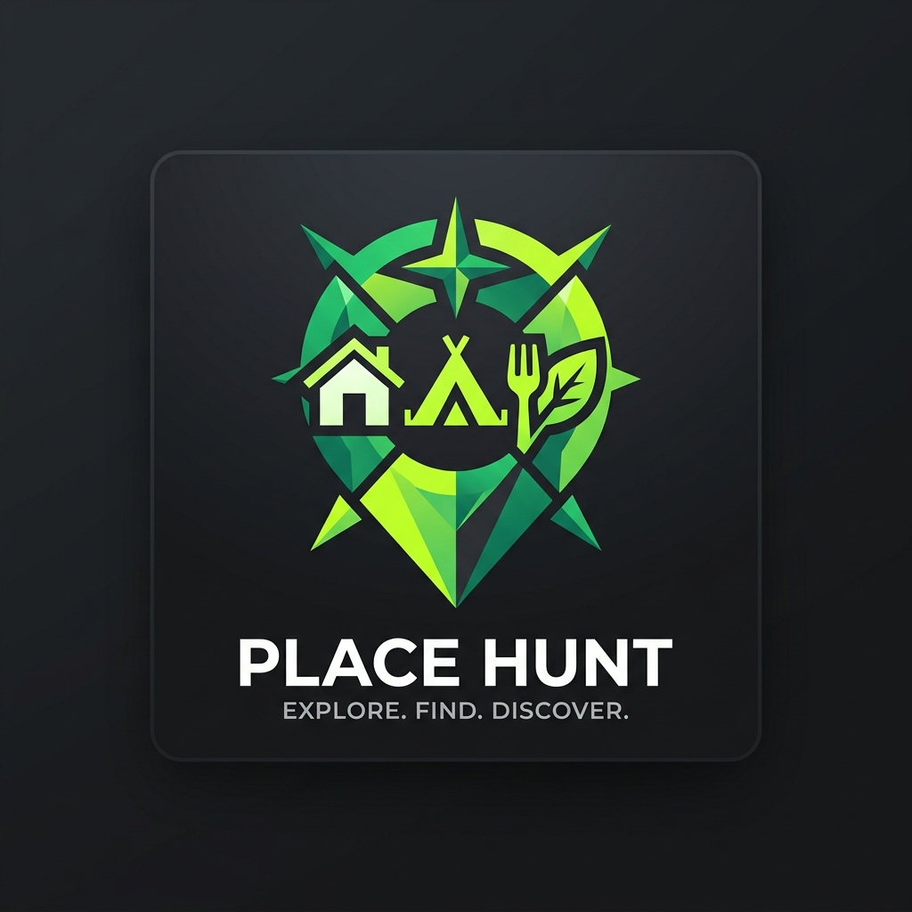

# Place Hunt

<p align="center">
  
</p>

Text your agent a photo, link, or request for any place: a space a group could use, a house or apartment for sale or rent, a camping spot, a park for a party, or a restaurant to visit. It figures out the details, looks up what the photo doesn't show, and pins it to a private map served on your Mac at `http://127.0.0.1:8787/`.

Listed on the [AI Worth Using Agent Index](https://aiworthusing.com/agent-index).

---

## What it does

- **Scout across 5 place categories**:
  - 👥 **Places for groups**: Event venues, retreats, meeting rooms (capacity, rates, AV, parking).
  - 🏠 **Home search**: Houses and apartments for sale or rent (Compass, Zillow, Redfin).
  - ⛺ **Camping spots**: Campgrounds, tent/RV sites, cabins (Recreation.gov, Hipcamp).
  - 🌳 **Parks for a party**: Public parks with reservable pavilions, BBQ pits, playgrounds.
  - 🍽️ **Restaurants to visit**: Great spots for dinner or group dining (cuisine, price tier, reservations).
- **Text a screenshot or paste a link**: A Yelp listing, a Compass link, an Instagram flyer, or a photo of a park sign — anything with a name or address.
- **Talk to it normally**:
  - *"Find parks near Oakland with a reservable pavilion for 30 people."*
  - *"Which camping spots near Tahoe have lake access?"*
  - *"The pizza place on Stockton — 5 stars, amazing crust."*
  - *"Mark Oak as passed."*
- **Open the map**: `http://127.0.0.1:8787/`. Filter by category (Homes, Groups, Camping, Parks, Dining) or view all places with custom status rings, photos, and key facts.

---

## How it works

- **You hold the logic. The Mac holds the data**:
  The Place Hunt agent runs in a container built on the [Plow base image](https://github.com/plow-pbc/plow-hermes-agent). The Mac holds only [Plow Latch](https://github.com/plow-pbc/latch) and your data in `~/Plow/properties/`.
- **Private & Local**:
  The map is bundled [Leaflet](https://leafletjs.com) with zero third-party cloud trackers. Nominatim geocodes addresses and OpenStreetMap serves map tiles. Your notes, ratings, and addresses stay private. The local file server starts at login via launchd.
- **Built-in Agent Index Usage Reporting**:
  The container includes the background `agent-index` service to report usage to the [AI Worth Using Leaderboard](https://aiworthusing.com/agent-index/publish).

---

## Quickstart

### 1. Configure Credentials

```sh
cp plow-credentials.example plow-credentials
```

Fill in your Plow tokens and Latch credentials in `plow-credentials`:
```sh
PLOW_API_BASE=https://api.plow.co
PLOW_AGENT_TOKEN=...
AGENT_ID=place-hunt
DOMO_DEVICE_UID=...
DOMO_MCP_TOKEN=...
```

### 2. Run with Docker Compose

```sh
docker compose up -d
```

Or deploy locally using the Plow CLI:
```sh
plow-agents deploy --local --line ln_p1
```

The image seeds the skill into `skills/productivity/place-hunt` (and `skills/productivity/property-hunt` for backward compatibility).

---

## Publishing to the Leaderboard

See [PUBLISHING.md](PUBLISHING.md) for full instructions on publishing your agent to the [AI Worth Using Agent Index](https://aiworthusing.com/agent-index/publish).

Quick registration:
```sh
python3 agent_index_client.py --register \
  --agent place-hunt \
  --name "Place Hunt" \
  --blurb "Search and map places for groups, homes, camping spots, party parks, and restaurants" \
  --logo ./logo.png
```

Check reporting status:
```sh
python3 agent_index_client.py status
```

---

## Testing

Run the test suite:
```sh
NODE_OPTIONS="--experimental-strip-types" node --test skill/scripts/*.test.ts
```

---

## License

[MIT](LICENSE)
